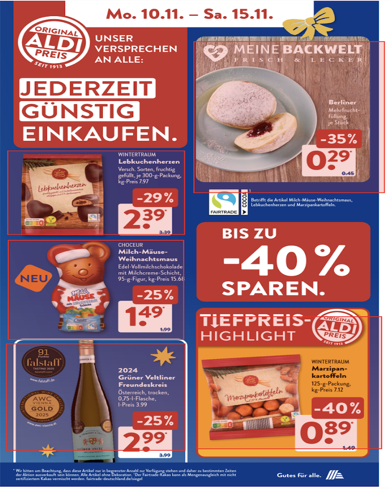
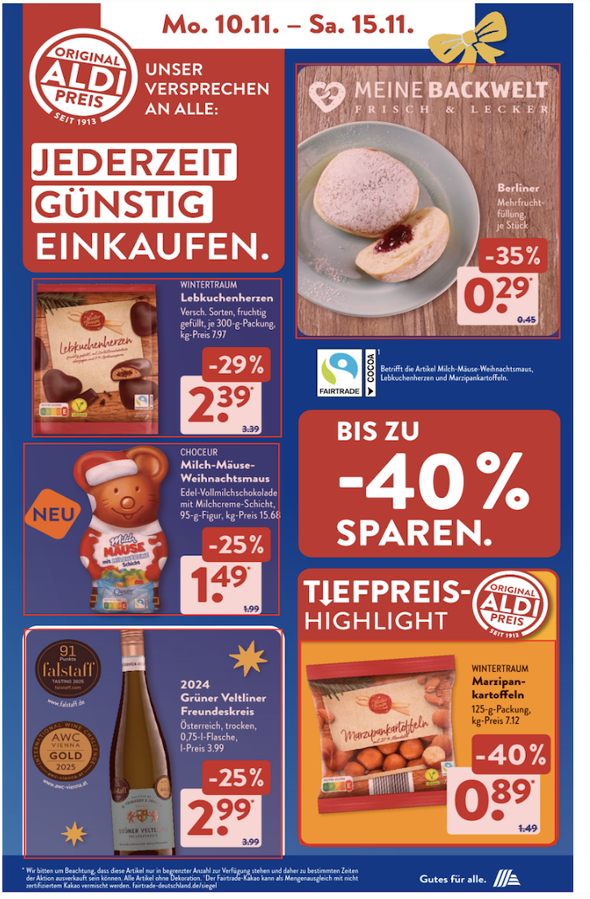

# Guide to the Data

## Overview
This directory contains the dataset used for the Smart Deal Finder project.
The goal of the dataset is to provide high-quality supermarket brochure pages with structured product-level information, enabling benchmarking of OCR, layout understanding, and multimodal extraction models.
Each page contains multiple product deals, each annotated with:

- Product name
- Price
- Discount (if available)
- Unit / package information
- Original price (if available)
- Bounding box around the product region

The dataset supports tasks such as:

- Document layout segmentation
- Product offer extraction
- Multimodal brochure understanding
- Benchmarking LLM-based extraction vs. rule-based or OCR-based pipelines

## Data Sources

The images in this dataset were manually collected from German supermarket chains, primarily:
- REWE
- Aldi Süd
- Edeka
- Kaufland
- Netto
- Penny
- Rossmann

All brochure pages are publicly accessible promotional materials and are used solely for research and educational purposes.
PDFs were preprocessed into uniform PNG format and stored under [image_uniform](images_uniform), for example, the PNGs of Rewe brochures are stored under [image_uniform/rewe](images_uniform/rewe), while the annotated JSON files under [image_uniform/rewe_annotated](images_uniform/rewe_annotated)
```text
project/
├── data/
│   ├── image_uniform/
│   │   ├── rewe # uniform PNG (1024 x 1448)
│   │   ├── rewe_annotated # annotation for each PNG (JSON files)
│   │   ├── ...
```

## Annotation Methods
Annotations were created using **Label Studio** and **Gemini 2.5 pro** with the following labeling interface:
- A RectangleLabels tool for marking each product deal region (bounding box region).
- Multiple TextArea fields for structured metadata:
  - product_name
  - price
  - discount
  - unit
  - original_price

Annotation Workflow
1. Create annotations for each brochure images with the help of Gemini
2. Convert the annotations into JSON files
3. Upload brochure images and corresponding Json annotations into a Label Studio project.
4. For each product card:
   - Check if bounding box covering the entire deal region.
     - Bounding boxes should just cover the deal region with all the information included.
     - Bounding boxes are stored as percentages (0–100) in Label Studio coordinates, but later they will be standardized into the 0-1.
   - Check product information in the corresponding text fields.
     - Prices include only numeric characters (e.g., "1.79" instead of "€1.79").
     - Discounts exclude the percent symbol (e.g., "20" not "-20%").
     - Units follow the complete description on the brochure.
     - Unavailable fields are stored as empty strings ("") or null.
5. Save the annotation, then export all labeled tasks as JSON.
6. Convert the JSON exported from Label Studio into a required structure like [rewe_annotated/example](images_uniform/rewe_annotated/rewe_10112025_page_1.json).

Here are the same brochure page before and after annotation:
```html
<table>
  <tr>
    <td align="center"><b>Gemini Annotation</b></td>
    <td align="center"><b>Human Annotation After</b></td>
  </tr>
  <tr>
    <td></td>
    <td></td>
  </tr>
</table>
```

## Exported and Normalized Annotation Format
Label Studio exports each annotated page as a dictionary inside a JSON list.
```json
{
  "image": "/data/upload/2/0453b2be-rewe_10112025_page_1.png",
  "id": 36,
  "deal": [
    {
      "x": 12.13,
      "y": 27.21,
      "width": 24.24,
      "height": 19.88,
      "rotation": 0,
      "rectanglelabels": ["Deal"],
      "original_width": 1024,
      "original_height": 1448
    }
  ],
  "product_name": ["Monster Energy Drink"],
  "price": ["0.77"],
  "discount": [""],
  "original_price": [""],
  "unit": ["je 0,5-l-Dose"]
}
```
For downstream processing and benchmarking, each page is converted into a clean JSON list where each product is represented as a single object:
```json
[
  {
    "product_name": "Monster Energy Drink",
    "price": "0.77",
    "discount": null,
    "unit": "je 0,5-l-Dose",
    "original_price": null,
    "bbox": [0.12, 0.27, 0.36, 0.46]
  },
  {
    "product_name": "Nutella",
    "price": "1.99",
    "discount": null,
    "unit": "je 450-g-Glas",
    "original_price": null,
    "bbox": [0.63, 0.75, 0.88, 0.97]
  }
]
```
Data without deal information are annotated as:
```json
null
```

## License and Usage
The dataset is intended solely for academic research and educational purposes, not for commercial redistribution.
Please ensure compliance with the terms of supermarket promotional material usage in your jurisdiction.

## Contact
For questions regarding the dataset format or annotation pipeline:

Liyang Deng

Email: <liyang.deng@stud.uni-heidelberg.de>
