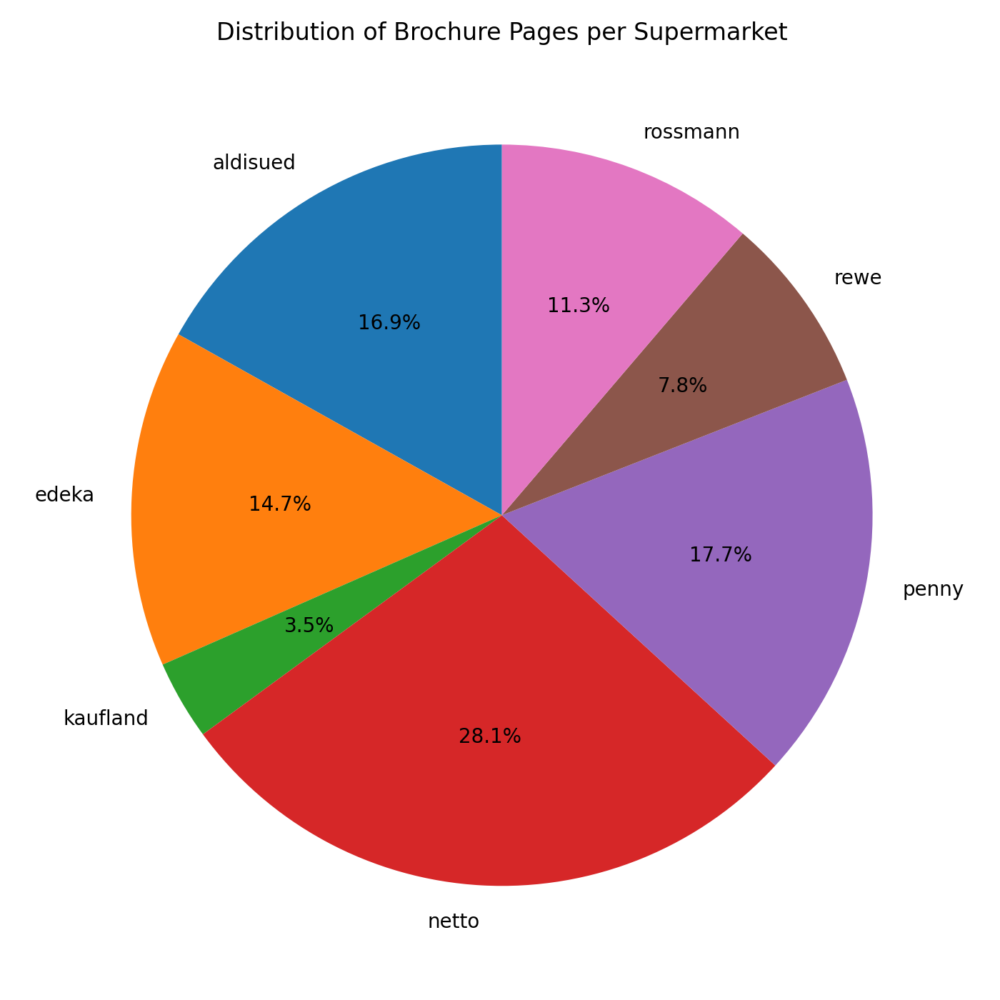
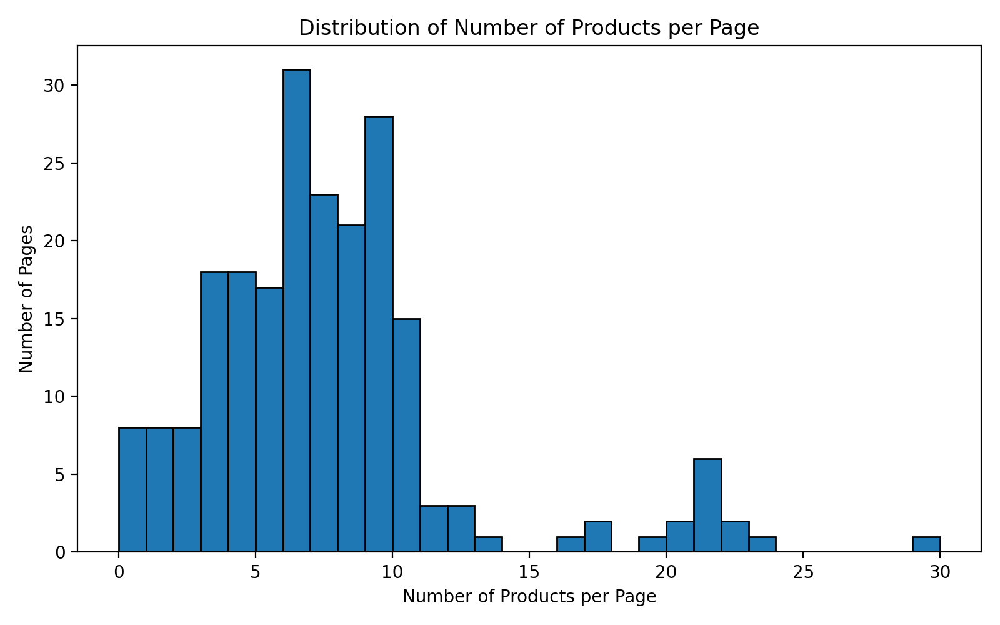
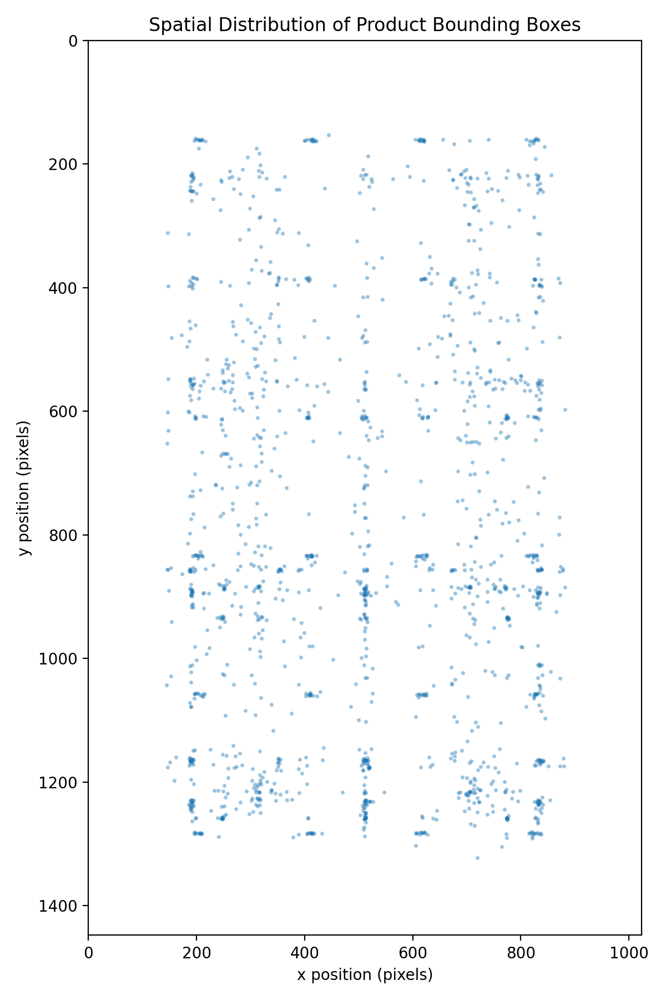
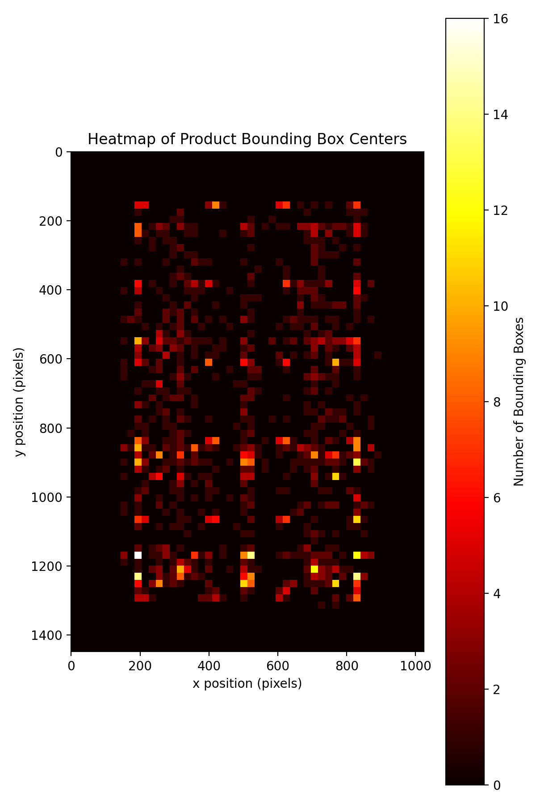
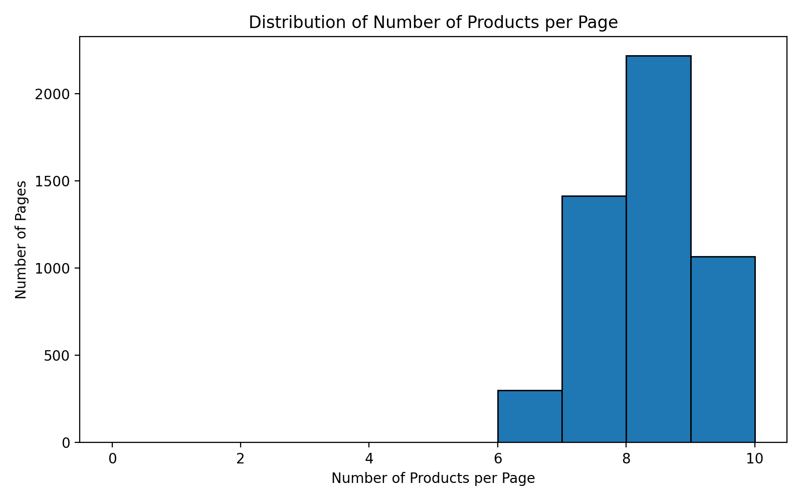
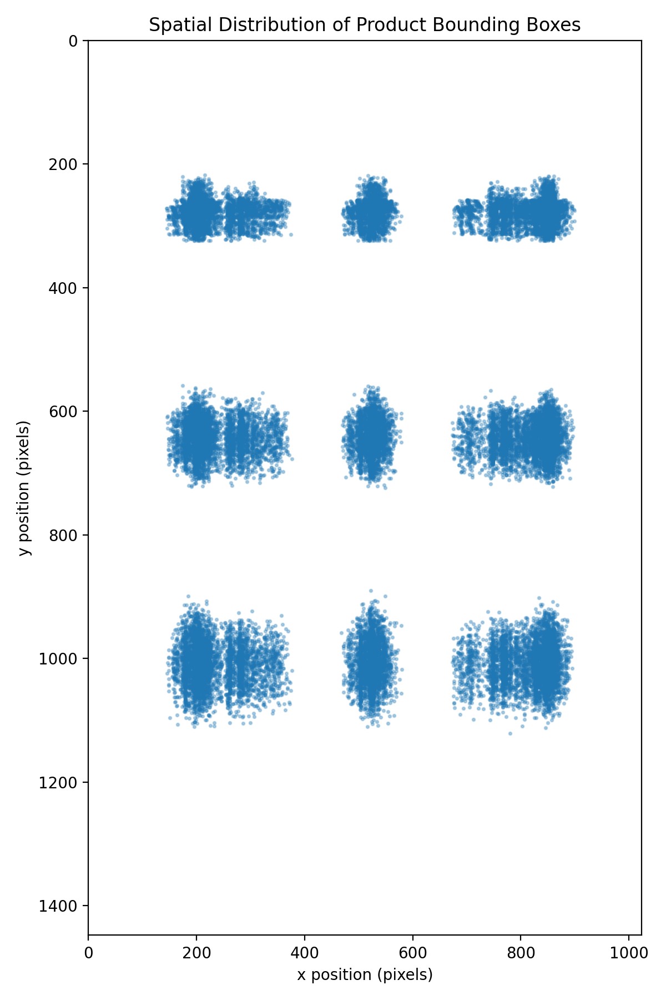

# Guide to the Data

## Overview
This directory contains the dataset used for the Smart Deal Finder project.
The goal of the dataset is to provide high-quality supermarket brochure pages with structured product-level information, enabling benchmarking of OCR, layout understanding, and multimodal extraction models. A synthetic dataset with machine-generated synthetic brochures is also provide, with which a model for Smart Deal Finder can be fine-tuned.
Each page contains multiple product deals, each annotated with:

- Product name
- Price
- Discount (if available)
- Unit / package information
- Original price (if available)
- Bounding box around the product region

The dataset supports tasks such as:

- Document layout segmentation
- Product offer extraction
- Multimodal brochure understanding
- Benchmarking LLM-based extraction vs. rule-based or OCR-based pipelines

## Data Sources

The images in this dataset were manually collected from German supermarket chains, primarily:
- REWE
- Aldi Süd
- Edeka
- Kaufland
- Netto
- Penny
- Rossmann

### Human-validated Machine-labeled Data
All brochure pages and other materials are publicly accessible promotional materials and are used solely for research and educational purposes.
PDFs were preprocessed into uniform PNG format and stored under [image_uniform](images_uniform), for example, the PNGs of Rewe brochures are stored under [image_uniform/rewe](images_uniform/rewe), while the annotated JSON files under [image_uniform/rewe_annotated](images_uniform/rewe_annotated)
```text
project/
├── data/
│   ├── image_uniform/
│   │   ├── rewe # uniform PNG (1024 x 1448)
│   │   ├── rewe_annotated # annotation for each PNG (JSON files)
│   │   ├── ...
```
### Synthetic data
For some other models that needs a task-specific fine-tuning process, we also provide synthetic data. 

The generation method is inspired by *SynthTIGER* from [Yim et al](https://arxiv.org/abs/2107.09313).

We have prepared the materials (products crawled from internet) for you to generate, you only need to run the generation code.
```bash
python3 synthesis_flyer.py --num_flyers
```

The dataset is hosted on Google Drive due to size/license constraints. You can directly download with Google Drive [syn_data_1](https://drive.google.com/file/d/1E4nCnD1LgnlhfHW199trpqQhqA_zyL0V/view?usp=drive_link) and [syn_data_2](https://drive.google.com/file/d/1fx-dQHXKCJxRcTJAcdXDghrVYGBU7yDb/view?usp=drive_link). And unzip them yourself. Access: read-only  

## Data Statistics

### Human-validated Machine-labeled Data

#### Numbers of Brochure pages from Each Supermarket

There are totally 299 brochure pages from 7 supermarket. And their distribution are shown as followed:



#### Average Number of Products per Page

The figure below shows the average number of annotated product deals per brochure page.


#### Product Count Distribution

The distribution shows that most brochure pages contain between 4 and 10 products, with a clear right-skewed long tail, indicating the presence of a small number of highly dense pages.



#### Spatial Distribution of Product Deals

The figures visualize the spatial distribution of product bounding boxes across all brochure pages.
Each point corresponds to the center of a product deal region, projected onto a normalized page layout
(1024 × 1448).

A clear layout bias can be observed, reflecting common brochure design patterns such as column-based layouts
and central content concentration.

<p align="center">
  
  
</p>

### Synthetic Data

#### Average Number of Products per Page


#### Product Count Distribution

Ignoring the data on the right-skewed long tail of distribution from human-validated machine-labeled data, this distribution resembles the upper one.



#### Spatial Distribution of Product Deals

The distribution follows the pattern of the real-world data, namely column-based layouts
and central content concentration.

<p align="center">
  
  
</p>

## Recommended Data Splits

To avoid information leakage caused by highly similar layouts within the same brochure, we recommend splitting the dataset **by brochure or by supermarket chain**, rather than random page-level splits.

A typical setup could be:
- 70% training
- 15% validation
- 15% test

Synthetic data should only be used for training or and must not overlap with evaluation data.
These data can be generated and mixed with the real data only for fine-tuning, but remember to separate the test and training data. 

## Annotation Methods
Annotations were created using **Label Studio** and **Gemini 2.5 pro** with the following labeling interface:
- A RectangleLabels tool for marking each product deal region (bounding box region).
- Multiple TextArea fields for structured metadata:
  - product_name
  - price
  - discount
  - unit
  - original_price

## Annotation Workflow
1. Create annotations for each brochure images with the help of Gemini
2. Convert the annotations into JSON files
3. Upload brochure images and corresponding Json annotations into a Label Studio project.
4. For each product card:
   - Check if bounding box covering the entire deal region.
     - Bounding boxes should just cover the deal region with all the information included.
     - Bounding boxes are stored as percentages (0–100) in Label Studio coordinates, but later they will be standardized into the 0-1.
   - Check product information in the corresponding text fields.
     - Prices include only numeric characters (e.g., "1.79" instead of "€1.79").
     - Discounts exclude the percent symbol (e.g., "20" not "-20%").
     - Units follow the complete description on the brochure.
     - Unavailable fields are stored as empty strings ("") or null.
5. Save the annotation, then export all labeled tasks as JSON.
6. Convert the JSON exported from Label Studio into a required structure like [rewe_annotated/example](images_uniform/rewe_annotated/rewe_10112025_page_1.json).

Here are the same brochure page before and after annotation:

<table>
  <tr>
    <td align="center"><b>Gemini Annotation</b></td>
    <td align="center"><b>Human Annotation After</b></td>
  </tr>
  <tr>
    <td></td>
    <td></td>
  </tr>
</table>


## Exported and Normalized Annotation Format
Label Studio exports each annotated page as a dictionary inside a JSON list.
```json
{
  "image": "/dataset/upload/2/0453b2be-rewe_10112025_page_1.png",
  "id": 36,
  "deal": [
    {
      "x": 12.13,
      "y": 27.21,
      "width": 24.24,
      "height": 19.88,
      "rotation": 0,
      "rectanglelabels": ["Deal"],
      "original_width": 1024,
      "original_height": 1448
    }
  ],
  "product_name": ["Monster Energy Drink"],
  "price": ["0.77"],
  "discount": [""],
  "original_price": [""],
  "unit": ["je 0,5-l-Dose"]
}
```
For downstream processing and benchmarking, each page is converted into a clean JSON list where each product is represented as a single object:
```json
[
  {
    "product_name": "Monster Energy Drink",
    "price": "0.77",
    "discount": null,
    "unit": "je 0,5-l-Dose",
    "original_price": null,
    "bbox": [0.12, 0.27, 0.36, 0.46]
  },
]
```
Data without deal information are annotated as:
```json
null
```

## Limitations and Future Work

While the dataset covers a diverse set of supermarket brochures, it is limited to a fixed page resolution and a single document type. Layout patterns and product representations may therefore not fully generalize to other promotional formats or regions. In addition, some pages contain no valid product deals, and certain fields (e.g., discounts) are sparsely populated, which may affect model performance and evaluation stability. Meanwhile, the quantity of the pages cannot be regarded as sufficient.

The annotation workflow is also not perfect. The annotation only by one person is exhausted and therefore problematic to some degree.

If we have more time and resource. We will annotate more data and with a more proper way. More supermarkets and pages will be included. An more correct approach to make sure the correctness of the annotations will also be introduced.

## License and Usage
The dataset is intended solely for academic research and educational purposes, not for commercial redistribution.
Please ensure compliance with the terms of supermarket promotional material usage in your jurisdiction.

## Contact
For questions regarding the dataset format or annotation pipeline:

Liyang Deng

Email: <liyang.deng@stud.uni-heidelberg.de>
